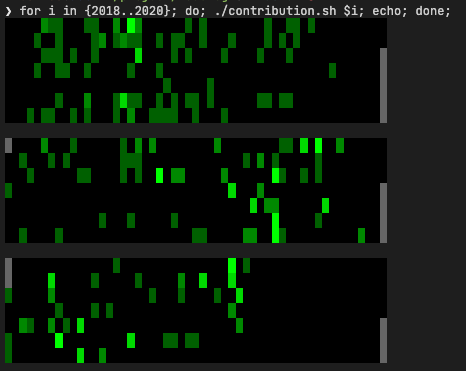

# bash-git-contribution-plot

This script collects the repo contributors, and shows the contribution activity strip for the selected user.

My intention was to have some fun with bash colors, and to get contribution info per repository.



## Usage

```bash
./contribution_plot 2019 ~/project/gitrepo example@domain.com
```

## Improvement ideas

- [x] plot data for a single email
- [x] plot data for a single year
- [x] plot any local git repo
- [x] handle leap years
- [ ] do not show future days as empty contribution, mark them with `noday_mark`
- [ ] for current year add option to show data from last year to fill the gaps
- [ ] make it easily runnable in docker (make it cross compatible)
- [ ] add option to show all contribution per year
- [ ] validate input
